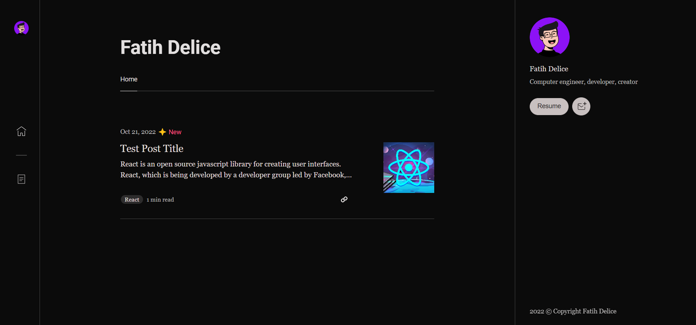
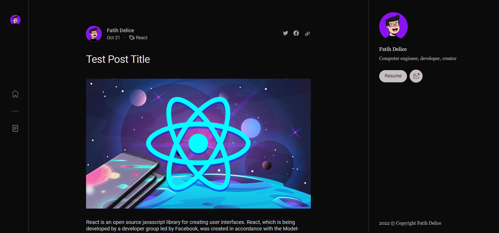

## Medium Clone with React & Firebase

# 📋 Usage 

```shell
// Clone the repository
git clone https://github.com/fatihdelice/medium-clone-react-firebase.git

npm install
```

Change `firebase.js` files to `firebaseConfig` values

```js
const firebaseConfig = {
    apiKey: "*****",
    authDomain: "*****",
    projectId: "*****",
    storageBucket: "*****",
    messagingSenderId: "369380797058",
    appId: "*****",
    measurementId: "*****"
};
```
If everything is ready

```shell
npm start
```

# 👁 Preview


<br><br>
